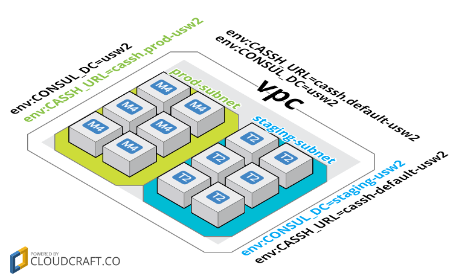

# limn

Limn is an EC2 Instance "description service." It allows an EC2 instance to
fetch its own metadata and tags without requiring IAM credentials. Limn is used
to bootstrap instances in EC2 with private metadata.

This is more secure than granting Instance Profiles or IAM credentials with
permission to `ec2:Describe*`, as AWS describe actions don't support
resource-level permissions. That means an instance with permission to
`ec2:Describe*` itself has permission to `ec2:Describe*` any other resource
within the same AWS account.

## Running limn

Limn includes a docker-compose.yml to get started. To run limn locally:

```console
$ docker-compose up
```

See [Configuration](#configuration) for more information on running limn as a
production service.

## Using limn

The limn API is simple. `POST` your EC2 instance's pkcs7 signed
[instance identity document](http://docs.aws.amazon.com/AWSEC2/latest/UserGuide/instance-identity-documents.html) against the limn server. If the signature is valid limn will attempt to call
AssumeRole against a preconfigured role inside the target account. If that
succeeds, limn finally responds with the decoded identity document and any
additional resources it discovers (`tags`, `hostnames`, `dhcpDomainName`, etc).

```console
$ curl -XPOST \
  --data-urlencode \
    "$(curl -s http://169.254.169.254/latest/dynamic/instance-identity/pkcs7)" \
  https://limn.company.com/
```
Which outputs:
```json
{
  "availabilityZone": "us-west-2a",
  "tags": {
    "Name": "redis-leader",
    "opt:cluster": "redis"
  },
  "instanceId": "i-860a042a",
  "region": "us-west-2",
  "dhcpDomainName": "us-west-2.compute.internal",
  "privateIp": "172.31.38.211",
  "version": "2010-08-31",
  "architecture": "x86_64",
  "imageId": "ami-a9d276c9",
  "instanceType": "t2.micro",
  "pendingTime": "2016-11-04T02:58:34Z",
  "hostnames": [
    "redis-leader",
    "redis-860a042a-ripetapir"
  ],
  "accountId": "123456789012"
}
```


## Configuration <a name="configuration" href="#configuration">:link:</a>

Limn configuration is passed as environment variables. Multiple values should
take the form of space-separated strings.

| var | defaults | cast | description |
|-----|----------|------|-------------|
| `AWS_ASSUME_ROLES` | `(empty string)` | `str.split()` | List of roles limn can assume to lookup resources in different accounts. If this is not set, or limn can't find a configured role associated with the instance's `accountId` it will attempt to use [boto3 credentials](http://boto3.readthedocs.io/en/latest/guide/configuration.html). |
| `INHERIT_TAGS` | `env:` `opt:` | `str.split()` | Whitelist of tag prefixes allowed to be inherited from parent resources. See [Tag Discovery](#tag-discovery) for details. |
| `ROLE_TAGS` | `opt:cluster` `clusterid` `elasticbeanstalk:environment-name` | `str.split()` | Used for dynamic hostname generation. See [Hostname Discovery](#hostname-discovery) for details. |
| `MEMCACHE_HOST` | `None` | `str()` | Limn supports caching results to memcached. If this is not set, limn disables memcached support. |
| `MEMCACHE_PORT` | `11211` | `int()` | Port for memcached if enabled with `MEMCACHE_HOST`. |
| `HOST` | `0.0.0.0` | `str()` | Flask binding host. |
| `PORT` | `8080` | `int()` | Flask binding port. |


### IAM Policy

Limn needs the following IAM permissions to run:

```json
{
    "Version": "2012-10-17",
    "Statement": [
        {
            "Effect": "Allow",
            "Action": [
                "ec2:DescribeDhcpOptions",
                "ec2:DescribeInstances",
                "ec2:DescribeTags",
                "ec2:DescribeVpcs",
                "autoscaling:DescribeAutoScalingInstances",
                "autoscaling:DescribeTags"
            ],
            "Resource": [
                "*"
            ]
        }
    ]
}
```

### Serving Multiple AWS Accounts with AssumeRole

To enable cross-account lookups with limn, update its IAM policy to include an
appropriate `sts:AssumeRole` statement for each account (including the one where
your limn server is running):

```json
{
    "Version": "2012-10-17",
    "Statement": [
        {"": "..."},
        {
            "Effect": "Allow",
            "Action": "sts:AssumeRole",
            "Resource": [
              "arn:aws:iam::<primary-account-number>:role/limn",
              "arn:aws:iam::<secondary-account-number>:role/limn",
            ]
        }
    ]
}
```

For each role limn can assume, attach a Trust Relationship to enable
cross-account access:

```json
{
  "Version": "2012-10-17",
  "Statement": [
    {
      "Effect": "Allow",
      "Principal": {
        "AWS": "arn:aws:iam::<primary-account-number>:role/limn"
      },
      "Action": "sts:AssumeRole"
    }
  ]
}
```

Configure the environment variable `AWS_ASSUME_ROLES` with the Role ARNs for
each account as a space-separated string.

## Tag Discovery <a name="tag-discovery" href="#tag-discovery">:link:</a>

Limn uses a hierarchical override to resolve tags for EC2 instances. If the tags
for any parent resource match a prefix defined by `INHERIT_TAGS` they're
returned as part of the instance description.

Inherited tags are discovered and overridden in the following order: `image`,
`vpc`, `subnet`, `auto-scaling-group`, and finally the `instance` itself. The
following graph shows tag inheritance and overriding in action. Instances in
each subnet inherit tags from their parent subnet, and their subnet's parent
vpc.



The tags set against resources are:

| resource  | tag | value |
|-----------|-----|-------|
| `vpc` | `env:CASSH_URL` | `cassh.default-usw2` |
| `vpc` | `env:CONSUL_DC` | `usw2` |
| `subnet-prod` | `env:CASSH_URL` | `cassh.prod-usw2` |
| `subnet-stage` | `env:CONSUL_DC` | `staging-usw2` |

The tags resolve with inheritance as:

| resource  | tag | value |
|-----------|-----|-------|
| `prod-instance(s)` | `env:CONSUL_DC` | `usw2` |
| | `env:CASSH_URL` | `cassh.prod-usw2` |
| `stage-instance(s)` | `env:CONSUL_DC` | `staging-usw2` |
| | `env:CASSH_URL` | `cassh.default-usw2` |

## Hostname Discovery <a name="hostname-discovery" href="#hostname-discovery">:link:</a>

Limn provides an opinionated hostname generator returning the instance's 'Name'
tag (if set), and a programmatic hostname with the format:

    <role>-<instance_id>-<adjective><animal>

 - `role` is discovered from the first resolved instance tag matching
`ROLE_TAGS` (case insensitive). By default it looks for the
following tags in order: `opt:cluster`, `clusterid`, and
`elasticbeanstalk:environment-name`.

- `instance_id` is stripped of leading `i-`, so `i-abcdefgh` becomes `abcdefgh`.

- `adjective` and `animal` are generated from wordlists using a consistent hash
function based on the instance id.

- `vpcDhcpDomainName` is discovered from the DHCP Options attached the the VPC
associated with the instance.
